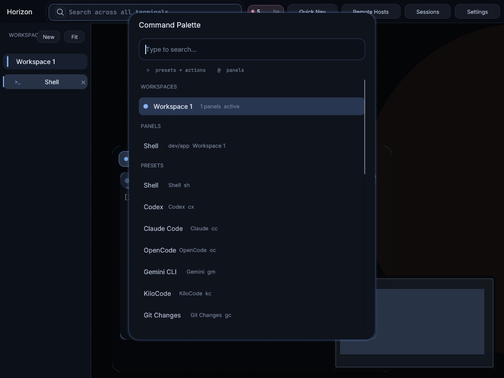
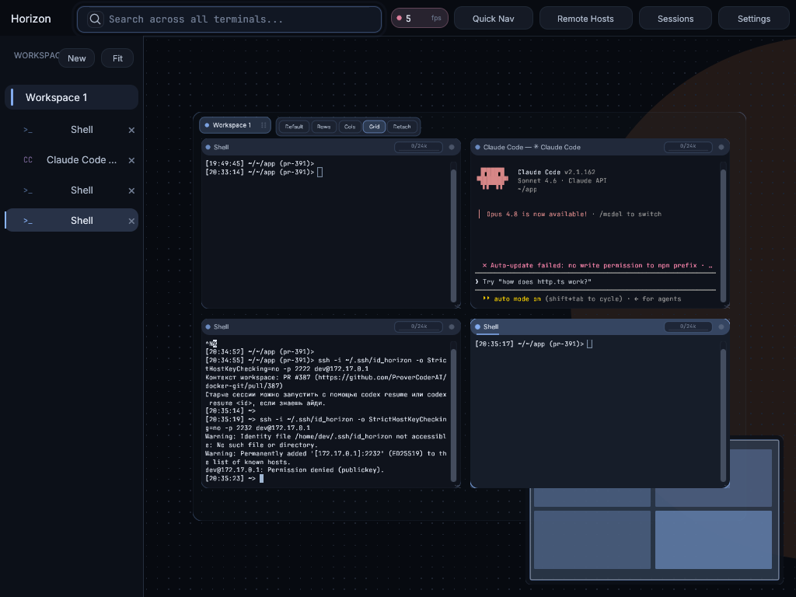
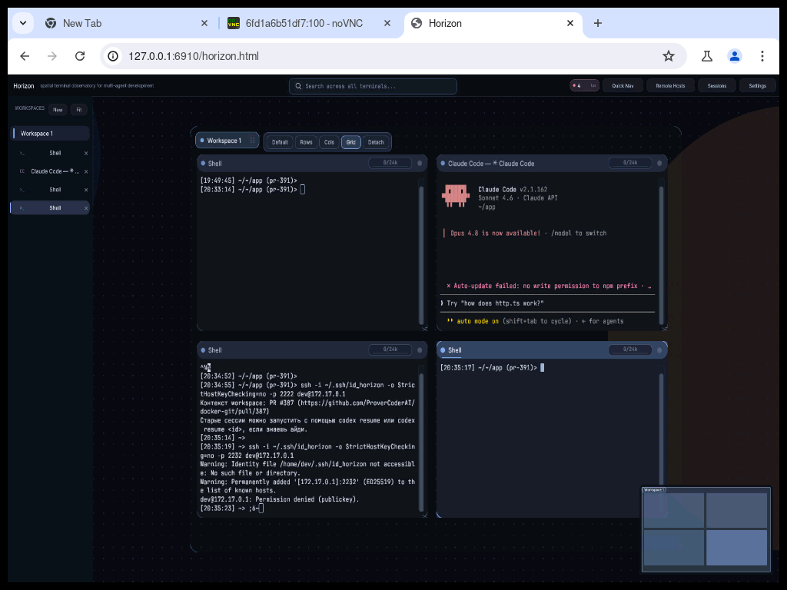

# Horizon Integration Analysis

Research note for [issue #389 — "Подумать об интеграции Horizon в проект"](https://github.com/ProverCoderAI/docker-git/issues/389).

The issue asks the team to *think about* integrating [Horizon](https://github.com/peters/horizon) into docker-git. This document captures that evaluation: what Horizon is, how it overlaps with docker-git, whether a direct integration is feasible today, and which concrete options are worth pursuing. It is a decision document, not an implementation.

## What Horizon Is

Horizon is a GPU-accelerated "terminal board" that places every terminal session on an infinite 2D canvas. Sessions live as panels that can be placed, resized, grouped into color-coded workspaces, and auto-arranged (rows / columns / grid). A minimap keeps the user oriented, and canvas layout, scroll positions, and terminal history are restored across restarts.

Verified facts (from the upstream repository, June 2026):

| Property | Value |
| --- | --- |
| Repository | https://github.com/peters/horizon |
| Author | `peters` |
| Language | Rust (Edition 2024) |
| License | MIT |
| UI / rendering | `egui` (immediate-mode UI) on `wgpu` (Vulkan / Metal / DX12 / OpenGL) |
| Terminal engine | `alacritty_terminal` |
| Distribution | Desktop binaries — Linux x64, macOS arm64/x64, Windows x64 (Homebrew, WinGet, Snap Store, direct download) |
| Configuration | `~/.horizon/config.yaml` (workspaces, panel presets, shortcuts, feature flags, theme) |
| AI integrations | First-class launchers for Claude Code, Codex, OpenCode, Gemini CLI, KiloCode, plus a token-usage dashboard |
| Web / remote mode | **None** — desktop-only, no embedded HTTP API or headless mode documented |

Sources:
- Upstream README — https://github.com/peters/horizon
- Show HN discussion — https://news.ycombinator.com/item?id=47416227
- Original issue reference (Telegram) — https://t.me/open_source_friend/5669

## How It Overlaps With docker-git

docker-git and Horizon solve adjacent problems, which is why the integration idea is attractive:

- **Both are terminal-session managers.** docker-git already exposes per-project terminal sessions over the web (`packages/terminal`, `packages/api/src/services/terminal-sessions.ts`, `pty-bridge.ts`) with reconnect, inline images, mobile controls, copy-selection, and a task manager.
- **Both target AI-agent workflows.** docker-git's `--auto` flow runs Claude / Codex / Gemini / Grok inside per-issue Docker environments; Horizon ships first-class launchers for the same agent CLIs.
- **Both already overlap on "GPU".** docker-git has GPU compose overlays (`docker-compose.gpu.yml`, `docker-compose.api.gpu.yml`) and a GPU create-flow choice (`menu-create-navigation.ts`), so a GPU-accelerated companion is not foreign to the project.

The key conceptual gap Horizon fills is **spatial organization**: docker-git lists terminal sessions in a panel/tab layout, while Horizon arranges them on an infinite canvas with workspaces and a minimap.

## Feasibility: The Hard Constraints

A direct "embed Horizon into the docker-git web UI" integration is **not feasible today**, for architectural reasons:

1. **Horizon is desktop-only.** It renders through `wgpu`/`egui` into a native window. There is no web build, no headless mode, and no embeddable view. docker-git's primary surface is a browser UI (`bun run docker-git -- browser`) served to LAN/remote devices. A native GPU window cannot be served to a browser the way the existing React terminal panels are.
2. **No control API or protocol.** Horizon is configured through a static `~/.horizon/config.yaml` and driven by its own UI. It exposes no HTTP/tRPC/WebSocket surface that docker-git could proxy — unlike Skiller, whose tRPC backend docker-git proxies per session (see [`skiller.md`](./skiller.md)).
3. **Session model mismatch.** Horizon owns its own PTYs through `alacritty_terminal` and persists them locally. docker-git's sessions are PTYs bridged from inside per-project Docker containers (`pty-bridge.ts`). Horizon has no concept of "attach to a PTY that already lives in a remote container," so it cannot natively front docker-git's container sessions.
4. **Runtime stack divergence.** Horizon is a Rust/`wgpu` binary; docker-git is a Bun + TypeScript + Effect-TS workspace with a strict Functional-Core/Imperative-Shell discipline (`CLAUDE.md`). Vendoring Rust GPU code into this workspace adds a toolchain and a maintenance surface unrelated to the rest of the project.

The Skiller integration worked precisely because Skiller is an Electron app with a tRPC backend that docker-git can launch and proxy. Horizon offers neither of those seams.

## Integration Options

Ordered from lowest to highest cost. None require committing to a direction in this PR — they are the menu for a follow-up decision.

### Option A — Document it as a complementary desktop client (recommended first step)

Treat Horizon as an *external* desktop board that a developer runs alongside docker-git, not something docker-git embeds. The two already share agent CLIs and SSH-based access. docker-git already advertises per-session SSH endpoints (`/ssh/session/:sessionId`); Horizon discovers hosts from SSH config and Tailscale. The lowest-cost, highest-confidence move is to make docker-git's per-project containers easy to add as Horizon panels via SSH, and document that workflow.

- Cost: low (docs + verifying the SSH path).
- Risk: low. No new runtime, no vendored code.
- Payoff: real today for users who already run a desktop.

### Option B — Borrow the UX, not the binary

The genuinely valuable, web-deliverable part of Horizon is its **interaction model**: an infinite canvas of terminal panels, color-coded workspaces, auto-arrange (rows/columns/grid), a minimap, and restored layout. docker-git already owns its terminal panels in React (`packages/terminal/src/web`). A canvas/workspace layout *for docker-git's existing sessions* could be built natively in the web UI, reusing docker-git's own PTY bridge, without adopting Horizon's Rust stack.

- Cost: medium-to-high (a real frontend feature).
- Risk: medium. Self-contained; no upstream coupling.
- Payoff: brings the headline benefit (spatial session management) to docker-git's actual web users.
- Note: this is "inspired by Horizon," not "integrating Horizon." It should be scoped as its own issue if pursued.

### Option C — Submodule + launcher (the Skiller pattern) — not currently viable

The Skiller model (pin as a `third_party` submodule, launch as a separate process, proxy its backend per session — see [`skiller.md`](./skiller.md)) does not transfer, because Horizon has no proxiable backend and no web view. Even launched, its native GPU window cannot be surfaced in docker-git's browser UI. Revisit only if upstream adds a headless/remote/web mode.

## Recommendation

1. **Do not embed or vendor Horizon now.** The desktop-only, API-less, Rust/`wgpu` design has no seam compatible with docker-git's web-served, container-bridged session model.
2. **Adopt Option A** as the immediate, low-risk step: position Horizon as a complementary external client and document the SSH-based workflow for adding docker-git project containers as Horizon panels.
3. **Track Option B separately.** The infinite-canvas + workspaces + minimap UX is the part worth bringing to docker-git's web UI, built natively on the existing terminal panels. It deserves its own scoped issue rather than being folded into "integrate Horizon."
4. **Re-evaluate Option C** only if Horizon upstream ships a headless or web/remote mode that exposes a controllable session API.

## Proof-of-Concept: Running Horizon in a Container (June 2026)

As part of this analysis, Horizon v0.2.6 was run inside a Docker container (the `dg-docker-git-pr-391` workspace) to empirically verify the claims above and explore what *is* feasible today.

### What was done

1. Downloaded the pre-built Linux x64 binary (`horizon-linux-x64.tar.gz`, v0.2.6).
2. Started a virtual display (`Xvfb :100 1920×1080`) inside the container.
3. Launched Horizon with Vulkan software rendering (`lvp_icd.json` / lavapipe): `WGPU_BACKEND=vulkan VK_ICD_FILENAMES=.../lvp_icd.json ./horizon`.
4. Exposed the display over VNC (`x11vnc`) → WebSocket (`websockify`) → browser-friendly viewer (custom noVNC HTML page, no toolbar).
5. Served the viewer via Cloudflare Tunnel (`trycloudflare.com`) for remote access.
6. Generated SSH keys, injected them into all running docker-git containers, and opened SSH terminal sessions from within Horizon onto sibling containers (`pr-387`, `megapolos-gui`, etc.).

### Screenshots

**Command Palette — built-in AI agent presets:**



Horizon ships first-class launchers for Shell, Codex, **Claude Code**, OpenCode, Gemini CLI, KiloCode, and Git Changes — accessible via `Ctrl+Shift+K`.

**Canvas with Shell + Claude Code panels (Workspace 1):**



Two panels on the infinite canvas: a local Shell (`~/app pr-391`) and Claude Code (`v2.1.162 · Sonnet 4.6`) — the agent launched automatically and is waiting for input (`ATTENTION agent — Ready for input`).

**Horizon running as a browser tab via noVNC + Cloudflare Tunnel:**



The VNC stream is served as a clean HTML page (no noVNC chrome) accessible via a public Cloudflare URL.

### Key finding: GPU is required for production use

Horizon ran and rendered correctly with lavapipe (Vulkan software renderer), but the experience is **not production-viable without a real GPU**:

| Metric | Software rendering (llvmpipe/lavapipe) | GPU (expected) |
|--------|----------------------------------------|----------------|
| Render FPS | 2–7 FPS | 60 FPS |
| Latency (VNC stream) | High — VNC encodes slow frames | Low |
| Usability | Functional for screenshots/demo | Full interactive speed |

The entire lag in the browser tab comes from this chain:
```
Horizon (CPU render ~5 FPS) → Xvfb → x11vnc → websockify → Cloudflare → browser
```

**To make this genuinely usable, the container needs a passthrough GPU** (NVIDIA via `nvidia-container-toolkit`, or AMD via `amdgpu`). docker-git already has `docker-compose.gpu.yml` overlays — adding a GPU allocation to the browser container would unlock hardware-accelerated Horizon rendering.

### Task status

| Item | Status |
|------|--------|
| Horizon runs in a container | ✅ Verified (v0.2.6, Vulkan lavapipe) |
| AI agent presets (Claude Code, Codex, etc.) | ✅ Confirmed built-in |
| SSH into sibling docker-git containers | ✅ Works (key-based auth) |
| Remote browser access via noVNC + Cloudflare | ✅ Works |
| Interactive speed without GPU | ❌ 2–7 FPS — not usable |
| Remote Hosts (Tailscale discovery) | ❌ Requires Tailscale — not available |
| Custom SSH presets in `config.yaml` | ❌ Horizon only supports built-in preset types |
| **GPU acceleration in container** | 🔲 **Blocked — needs GPU passthrough** |

**Recommendation unchanged**: Option A (SSH workflow docs) is the right immediate step. However, this PoC confirms that *if GPU passthrough is enabled*, Horizon can run fully inside a docker-git browser container and be accessed remotely via the existing noVNC/Cloudflare pattern.

## Watch List (re-evaluate triggers)

Revisit this analysis if any of the following land upstream:
- Horizon adds a headless mode, web build, or remote-rendering surface.
- Horizon exposes a control API (HTTP/WebSocket/tRPC) for creating and attaching sessions.
- Horizon supports attaching to an externally-owned PTY (e.g. an SSH or container-bridged session) instead of only spawning its own.
